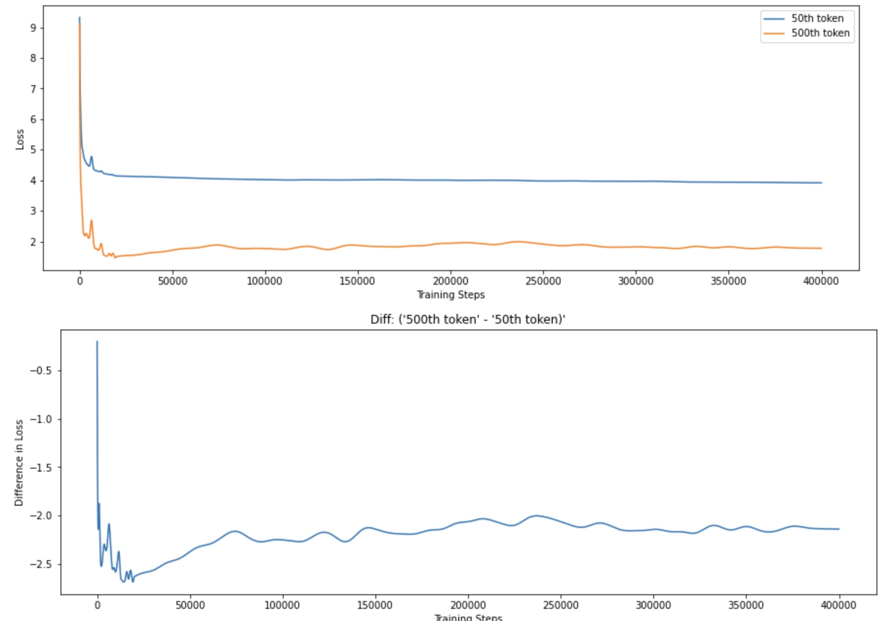
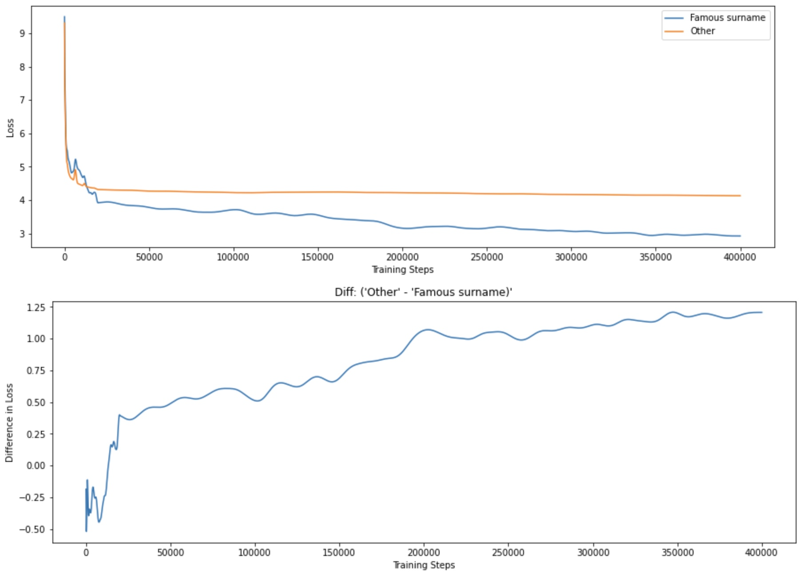

# Token Loss Trajectories

This project was a submission to the [AI testing hackathon](https://itch.io/jam/aitest), and won 2nd place - see the full results [here](https://itch.io/jam/aitest/results). 

## Description

Evaluations of ML systems typically focus on average statistical performance on a dataset measured at the end of training. However, this type of evaluation is relatively coarse, and not does not provide insight into the training dynamics of the model. We present tools for stratifying tokens into groups based on arbitrary functions and measuring the loss on these token groups throughout the training process of a Language Model. By evaluating the loss trajectory of meaningful groups of tokens throughout the training process, we can gain more insight into how the model develops during training, and make interesting observations that could be investigated further using interpretability tools to gain insight into the development of specific mechanisms within a model. We use this lens to look at the training dynamics of the region in which induction heads develop. We also zoom in on a specific region of training where there is a spike in loss and find that within this region the majority of tokens follow the loss trajectory of a spike, but a small set follow the inverse trajectory.

We used this method to investigate differences between the 500th and 50th token, following [Olsson et al.](https://transformer-circuits.pub/2022/in-context-learning-and-induction-heads/index.html) As shown in the images above, we similarly find that after the initial steep drop in loss during very early training, there is a region where the loss on the 500th token decreases significantly more than the loss on the 50th token. Beyond this point, loss on the 500th token increases slightly before staying essentially constant over the rest of training, whereas the loss on the 50th token gradually decreases. This corresponds to the finding that induction heads are the primary driver of in-context learning and develop early on in training.

We then looked at other tokens which are likely to benefit from induction head, specifically the surnames of US presidents (specifically ["Obama", "Trump", "Biden", "Clinton", "Bush", "Reagan"]). These surnames are likely to be preceded by one of a small set of tokens, and a given pair is likely to occur multiple times in an input, so would benefit from the induction head mechanism. As shown above, these tokens experience a sharp decrease in loss during the induction head region, but then show a different regime during the rest of training, where they undergo a gradual improvement in loss, potentially from the model slowly learning better n-gram statistics (or more complex contextual token statistics) , rather than a more general mechanism like the induction head. This shows how this token group trajectory lens can provide insight into different training dynamics.

See the [report](https://github.com/alexjfoote/token-loss-trajectories/blob/main/AI%20Testing%20Hackathon%20Write%20up%20submission.pdf) for the full details.
